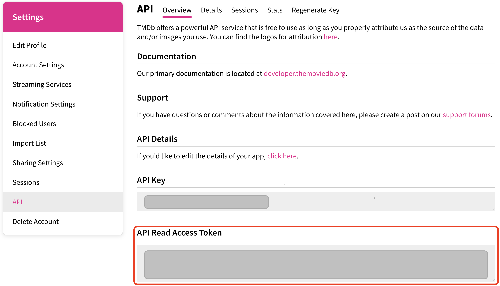

# Tier 4. Module 1: Mastering Front-End Development with React

## Topic 9 - React Router library
## Topic 10 - Navigation in the application. Code splitting

## Homework

### Technical task - Movie search

Write a routing application to find movies by title.

#### Movie search service

In this task, with the help of HTTP requests, you will receive movies from the [TMDB](https://www.themoviedb.org/) service. Register an account (you can enter arbitrary data) to get access to the [documentation](https://developer.themoviedb.org/docs/getting-started) and an access key for HTTP requests.

Useful sections of the documentation for you:
* [Trending movies](https://developer.themoviedb.org/reference/trending-movies) - a list of the most popular movies today to create a collection on the main page.
* [Search movie](https://developer.themoviedb.org/reference/search-movie) - search for a movie by keyword on the movies page.
* [Movie details](https://developer.themoviedb.org/reference/movie-details) - request full information about the movie for the movie page.
* [Movie credits](https://developer.themoviedb.org/reference/movie-credits) - request information about the cast for a movie page.
* [Movie reviews](https://developer.themoviedb.org/reference/movie-reviews) - request reviews for the movie page.

#### Access token

The access token must be attached to each request in the form of an **Authorization** HTTP header.

The access token is obtained from the **"API Read Access Token"** section of the [API page](https://www.themoviedb.org/settings/api).

#### Path to images

The backend will send, instead of a full link to the image, for example, for a movie poster, only the lines with just the name of the file.

To compile the full path to the image, you need to read the [documentation section](https://developer.themoviedb.org/docs/image-basics) dedicated to this issue.

In short, you need to manually add the path before the image name. As a result, you will get a full-fledged link to the image.

#### Navigation in the application

The application must have the following routes.

* `'/'` – `HomePage` component, a home page with a list of popular movies.
* `'/movies'` – `MoviesPage` component, a keyword search page for movies.
* `'/movies/:movieId'` - `MovieDetailsPage` component, a page with detailed information about a movie.
* `/movies/:movieId/cast` – `MovieCast` component, cast information. Renders at the bottom of the `MovieDetailsPage`.
* `/movies/:movieId/reviews` – `MovieReviews` component, information about reviews. Renders at the bottom of the `MovieDetailsPage`.
* If the user entered by a non-existent route, you need to show the `NotFoundPage` component, which contains a `Link` to the home page.

#### Files, folders and components:

* Page component files like `HomePage`, `MoviesPage`, `MovieDetailsPage`, `NotFoundPage` should be in `src/pages` folder.
* The `MovieCast` and `MovieReviews` components are not separate pages, they are only parts of the `MovieDetailsPage` page, so we store the files of these components in `src/components`.
* Move the menu with navigation links to the `Navigation` component. It consists of two `NavLink` components that point to `/` and `/movies` routes.
* To display a list of movies, create a `MovieList` component. Use it on `HomePage` and `MoviesPage`.

When clicking on the `Go back` link (after watching the actors/review), the user should return to the page from which he entered the movie details page. If the page has been updated and the location object has not been saved, then return the user to `/movies`.

#### Code splitting

Add asynchronous loading of JS code for application routes using `React.lazy` and `Suspense`.

### Acceptance criteria

* Main link: the assignment work page on [Vercel](https://vercel.com/).
* The project was created using [Vite](https://vitejs.dev/).
* For each component, there is a separate folder in the `src/components` folder that contains the JSX file of the React component itself and its styles file. The name of the folder, the component file (with the extension `.jsx`) and the style file (before `.module.css`) are the same and correspond to the names specified in the tasks (if there were any).
* For each page in the `src/pages` folder, there is a separate folder that contains the JSX file of the React component itself and its styles file. The name of the folder, the component file (with the extension `.jsx`) and the style file (before `.module.css`) are the same and correspond to the names specified in the tasks (if there were any).
* The JS code is clean and clear, using Prettier.
* Styling is done by CSS modules.
